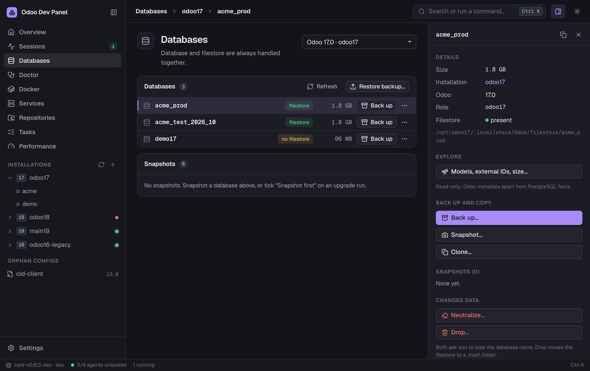

# Odoo Dev Panel

One control center for the Odoo development environments on an Ubuntu workstation: discover installations, diagnose and repair them, run and stop instances, and manage databases, however each installation was set up.

- **Discover** every Odoo source tree, venv, config, database, filestore, running process and systemd unit, without changing anything.
- **Run** an instance as its own Linux user, with a database, modules to install or upgrade, `--dev` flags or an interactive shell. Odoo keeps running when the app closes; only Stop ends it.
- **Doctor** finds broken venvs, unreadable or exposed configs, port clashes, failed units and missing filestores, and repairs a broken venv safely.
- **Databases:** back up, restore, clone with filestore, neutralize (default or your own SQL recipe) and drop, each with a plan you review first.
- **Snapshots** before risky work: one click, or automatically before a module upgrade. Revert puts a database back and keeps the replaced one under a new name.
- **Modules:** a dependency view of any config's addons paths, drawn as a picture per module: depends, required by, missing, shadowed and cyclic modules. Pick a database to see each module's state in it (installed, to upgrade, not in the database), modules installed at another version than the manifest, and modules the database holds that the addons_path does not have. Manifests are read, never imported.
- **Compare** two configs, two installations, or the installed modules of two databases: Odoo version, git commit, Python, venv packages, addons paths, options and module states, with expected differences marked.
- **Docker:** create an Odoo stack (Odoo + PostgreSQL in containers) with one dialog, nothing installed on the machine. Odoo containers sit next to native installations: image, version, compose project, ports, and where config, addons and data live on the host. Start, stop, restart, read the log with problems grouped, upgrade modules, back up, snapshot, restore, clone and drop databases of a container with its own PostgreSQL container. Doctor checks port clashes, a stopped database container, exit codes, missing mounts and unreadable configs.
- **Provision** a new installation for Odoo 15–20 with a pinned Python, a venv, a PostgreSQL role and a first config, from scratch or from a **profile** (TOML defaults plus a list of repositories, shareable without secrets).
- **Git workspace:** every repository of every installation with branch, changes and sync state; fetch, fast-forward pull, switch, clone and `addons_path` updates after a plan. Nothing destructive (no reset, clean, force or push); other users' repositories are only read.
- **Module center:** modules touched by uncommitted work with a suggestion, manifest checks, upgrade or install with a snapshot first, tests in a throwaway database (dropped when they pass), and a minimal scaffold.
- **Python environment:** requirement status of the venv against Odoo's and your repositories' requirement files, conflicts, installs with `uv` as the run-as user, import validation, and dev tools (debugpy, rtlcss, wkhtmltopdf with patched Qt).
- **Tasks:** saved workflows of these operations (for example snapshot, upgrade, test), previewed with every command and who runs it, data-changing steps confirmed, retry from the failed step, run history.
- **Debug:** start Odoo under debugpy as its own user with saved presets and attach VS Code; attach entries merged into `launch.json`; module tests under the debugger; every traceback line opens the file at that line in your IDE.
- **Performance:** Odoo CPU and memory, PostgreSQL sessions, lock waits, long queries and connection use, with a verdict on where a slowdown comes from; a read-only explorer of models, fields, relations, external IDs and table sizes; an SQL log grouped by statement.
- A desktop app and the `odp` CLI with the same features.

Website: **[sparkdrago05.github.io/odoo-dev-panel](https://sparkdrago05.github.io/odoo-dev-panel/)**

Status: active development, released on [GitHub](https://github.com/SparkDrago05/odoo-dev-panel/releases) and in an APT repository. Ubuntu 24.04 and 26.04, x86_64.



## Install

From the APT repository, so that `apt upgrade` brings new versions:

```sh
sudo install -d -m 0755 /etc/apt/keyrings
sudo wget -qO /etc/apt/keyrings/odoo-dev-panel.asc https://sparkdrago05.github.io/odoo-dev-panel/apt/odoo-dev-panel.asc
sudo tee /etc/apt/sources.list.d/odoo-dev-panel.sources >/dev/null <<'EOF'
Types: deb
URIs: https://sparkdrago05.github.io/odoo-dev-panel/apt
Suites: stable
Components: main
Architectures: amd64
Signed-By: /etc/apt/keyrings/odoo-dev-panel.asc
EOF
sudo apt update
sudo apt install odoo-dev-panel
```

Then join the `odoo-dev` group and log out and back in:

```sh
sudo usermod -aG odoo-dev "$USER"
```

Start **Odoo Dev Panel** from the application menu. Or install a downloaded `.deb` from the [releases page](https://github.com/SparkDrago05/odoo-dev-panel/releases) with `sudo apt install ./odoo-dev-panel_*_amd64.deb`. Details, the signing key fingerprint and first steps: [docs/install.md](docs/install.md).

## How it works

```
Desktop app (Tauri) ── JSON-RPC on stdio ──> odp sidecar (Python, as you)
                                               │ Unix socket /run/odoo-dev-panel/<user>.sock
                                               ▼
              sudo systemd-run --uid=odoo17 ──> odp agent (as the run-as user, one per user)
                                               │ own session, output to a log file
                                               ▼
                                          odoo-bin (survives app close and crashes)
```

You unlock each run-as user once per boot (one sudo prompt). Its agent then starts and stops Odoo without further passwords. Security model: [SECURITY.md](SECURITY.md).

## Documentation

Also on the [website](https://sparkdrago05.github.io/odoo-dev-panel/docs/install.html).

- [Install and first run](docs/install.md)
- [Troubleshooting](docs/troubleshooting.md)
- [Security](SECURITY.md)
- [Contributing](CONTRIBUTING.md): development setup, tests, code rules

## License

[Apache-2.0](LICENSE).
